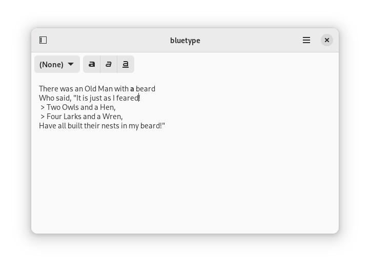

# Bluetype
A fast and lightweight word processor.

Bluetype is a work-in-progress. I am not looking for contributions at this
time. Please check back later!

## Building
To build, clone this repo in GNOME Builder. Make sure you have the
`gnome-nightly` flatpak repository installed. Builder will automatically
resolve dependencies for you.
